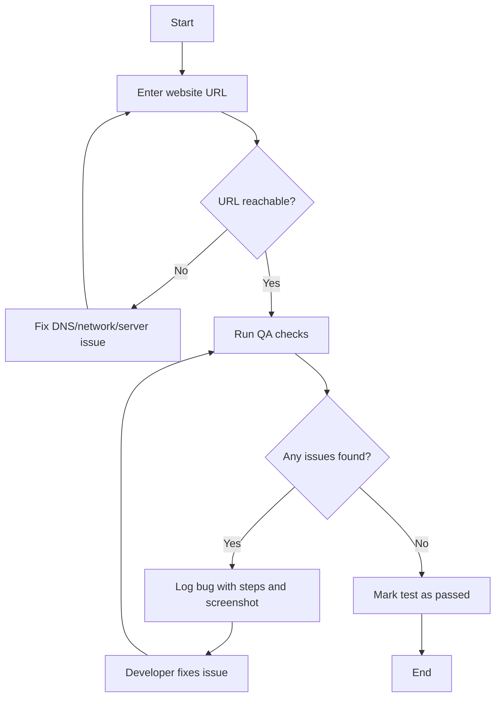
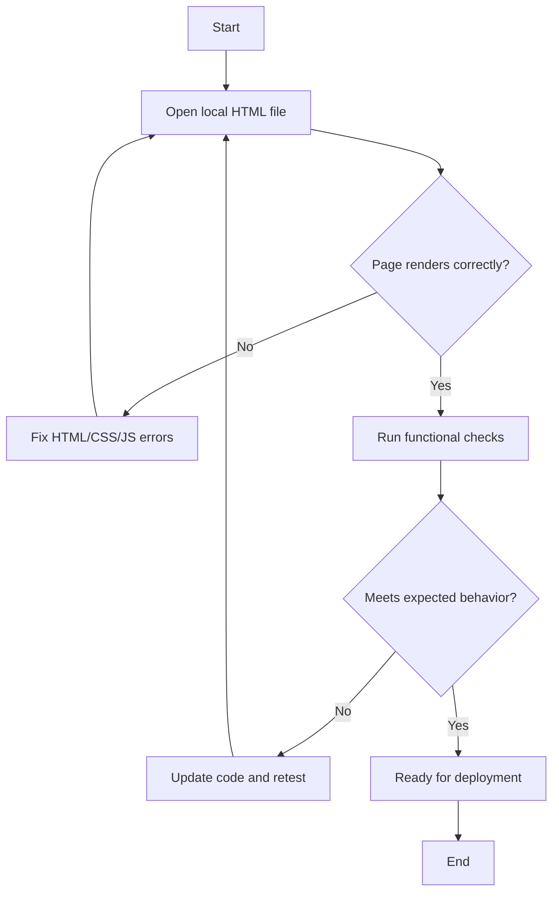

# generic-qa-test

Test any website using a URL (link) or a local HTML file.

## What this project helps you do

You can quickly validate a web page in two common ways:

1. **Live URL testing** (for public or staging sites)
2. **Local HTML testing** (for pages not deployed yet)

---

## Flowchart 1: Test a live website URL

### Real-life example

A QA engineer tests `https://shop.example.com` before a sale event:
- Verifies homepage load speed
- Checks product search
- Adds an item to cart and completes checkout
- Confirms order confirmation page appears

---

## Flowchart 2: Test a local HTML file

### Real-life example

A student builds a portfolio page in `index.html`:
- Opens the file in a browser
- Checks mobile responsiveness with dev tools
- Verifies contact form validation messages
- Fixes layout issues before uploading to hosting
